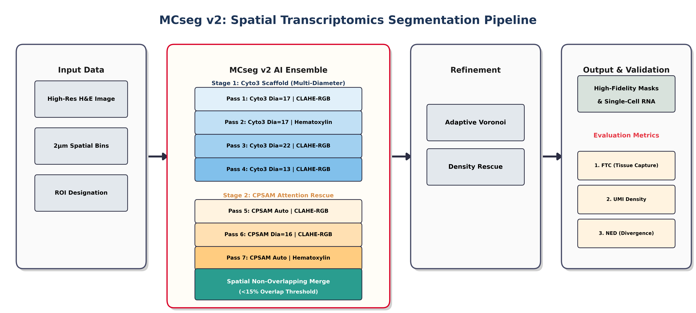
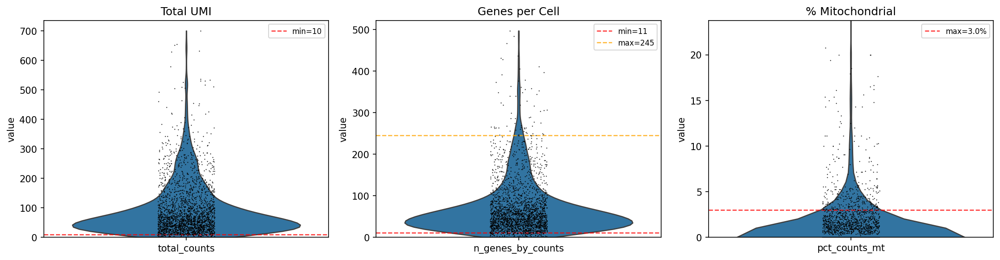
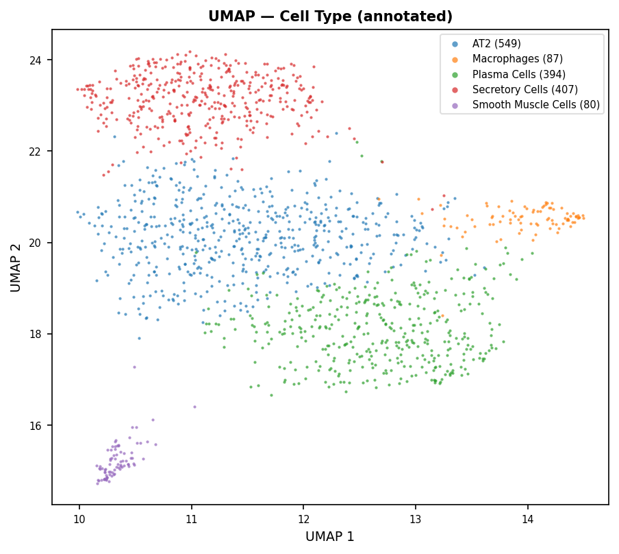
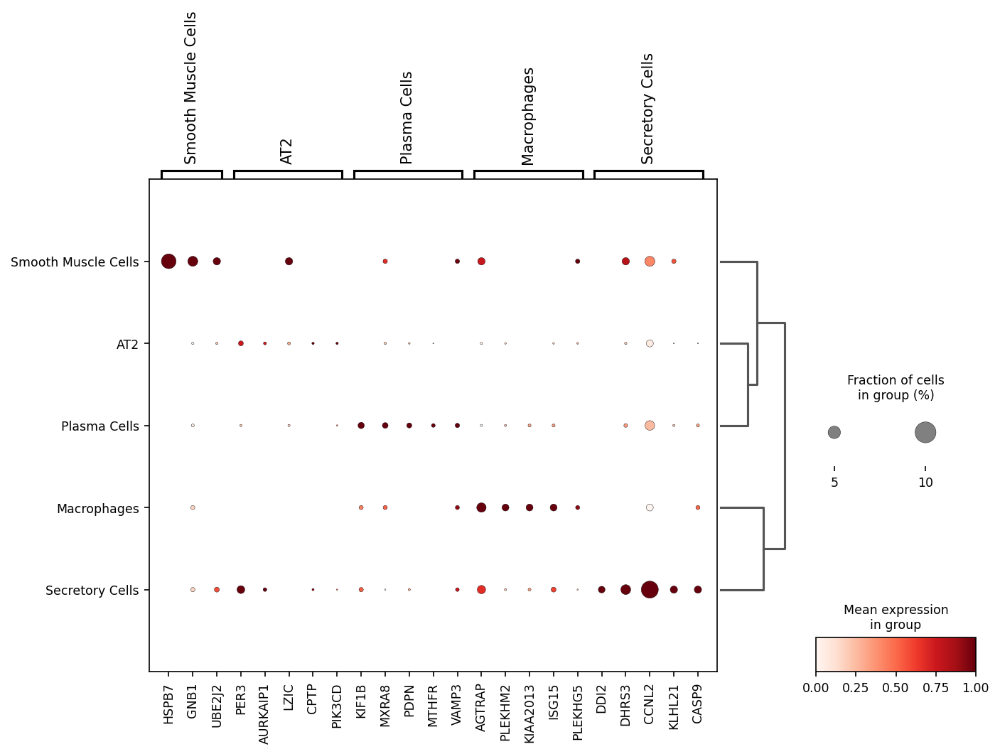
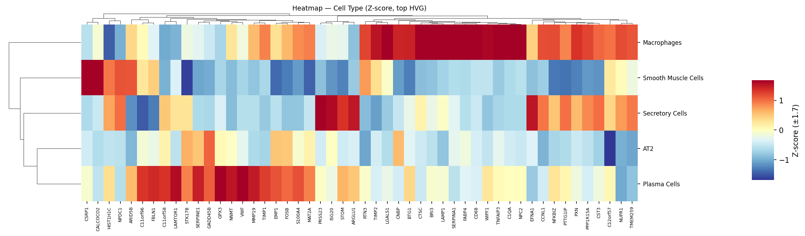
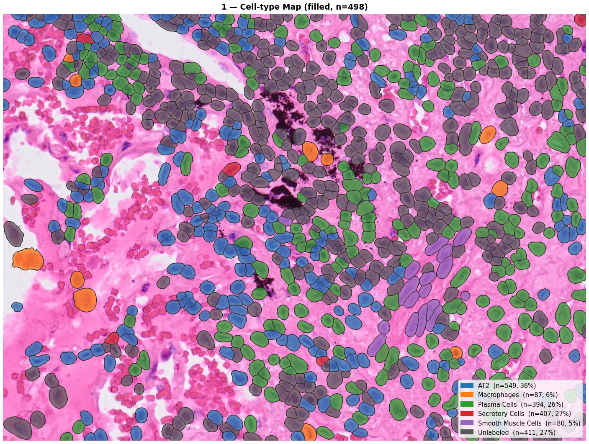
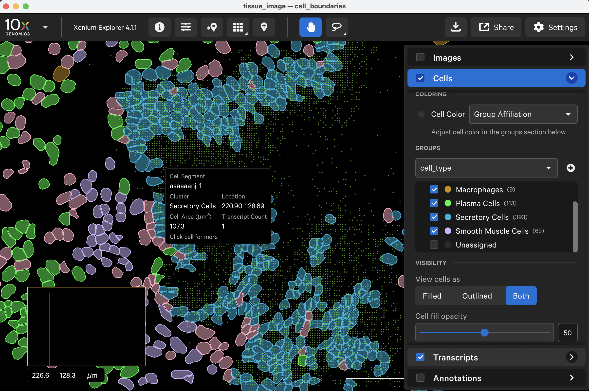
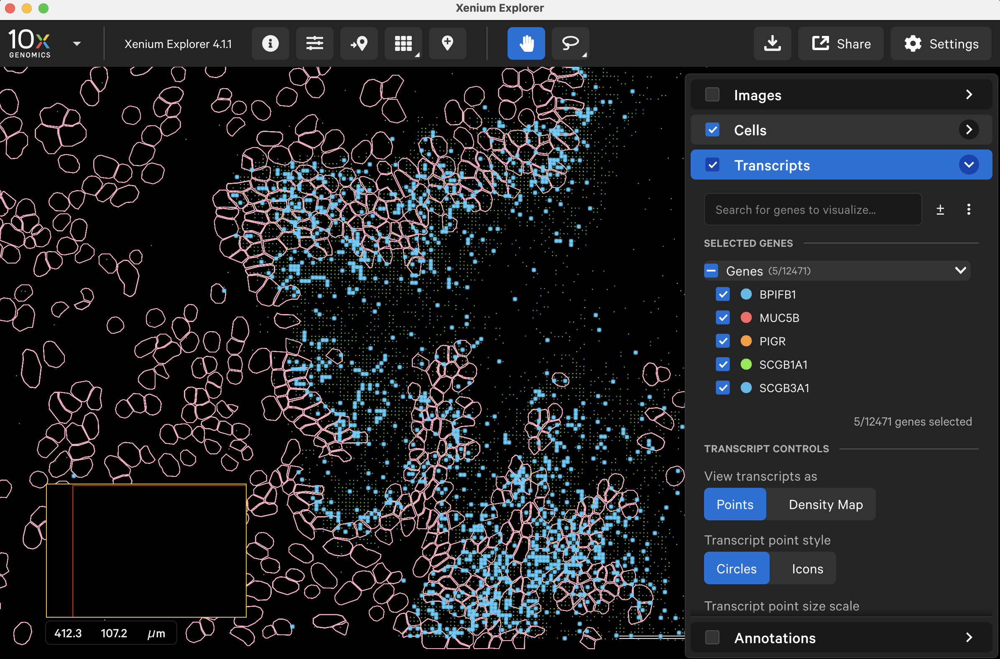
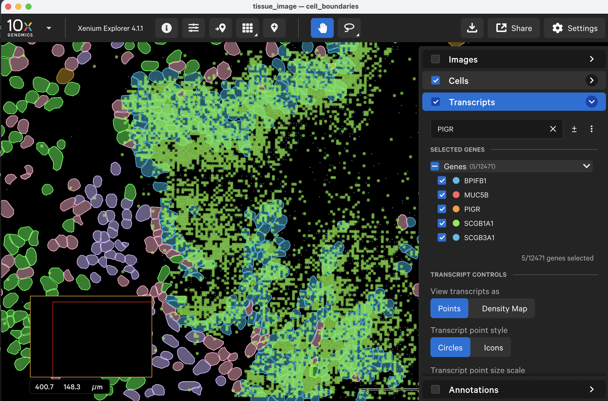

# MCseg: End-to-End Visium HD Spatial Transcriptomics Analysis with AI-Optimised Ensemble-Based Cell Segmentation

[](LICENSE)
[](https://www.python.org/)

✅ No-code web UI · ✅ Custom ROI from gigapixel BTF · ✅ End-to-end analysis (QC → UMAP → annotation) · ✅ Multi-ROI merge · ✅ Interactive spatial gene explorer · ✅ Xenium Explorer export · ✅ GPU optional

**MCseg** is a no-code, end-to-end analysis platform for 10x Genomics **Visium HD** (2 µm resolution) spatial transcriptomics data. Starting from a raw gigapixel BTF image, MCseg covers the complete workflow: custom ROI cropping, high-fidelity cell segmentation, RNA counting, downstream analysis (QC → UMAP → cell-type annotation), and one-click export to Xenium Explorer or Loupe Browser — all through a web interface requiring no programming.

Its core segmentation engine, **MCseg**, was developed through the **AutoResearch** paradigm — an AI-autonomous architecture search over ~80 evaluation cycles — yielding a seven-pass multi-model Cellpose ensemble with Voronoi-constrained boundary expansion. Against Xenium Prime ground truth in LUAD tissue, MCseg achieves **PQ = 0.554 ± 0.064** — a **+28% improvement** over the optimised dual-diameter baseline **2Cseg** (PQ 0.432 ± 0.037). In CRC, MCseg matches Space Ranger's transcript capture (UMI density 11.6 vs 11.7 UMI/µm²) while maintaining higher transcriptional boundary purity (NED 0.727 vs 0.712, p = 0.026). GPU is optional; full CPU fallback is supported.

<p align="center">
  
</p>

---

## Contents

[Quick Start](#quick-start) · [Pipeline Overview](#pipeline-overview) · [CLI (No-UI)](#cli-no-ui-whole-slide-pipeline) · [Interface Tour](#interface-tour) · [Example Results](#example-results) · [Output Structure](#output-structure) · [Usage Guide](#usage-guide) · [Algorithm](#mcseg-algorithm) · [Configuration](#configuration) · [Troubleshooting](#troubleshooting) · [Citation](#citation) · [License](#license)

---

## Quick Start

### System Requirements

| Component         | Minimum                          | Recommended                     | Notes                                                                                                            |
| ----------------- | -------------------------------- | ------------------------------- | ---------------------------------------------------------------------------------------------------------------- |
| **OS**      | macOS 12, Windows 10, Ubuntu 20.04 | macOS 13+ / Windows 11 / Ubuntu 22.04 | All three platforms fully supported                                                                         |
| **CPU**     | 4-core, any modern x86-64 or ARM | Apple Silicon (M1/M2/M3) or AMD/Intel | Apple Silicon → MPS; NVIDIA → CUDA GPU acceleration                                                        |
| **RAM**     | 8 GB                             | 16 GB+                          | Cellpose loads full ROI crops into memory; very large ROIs (>2000×2000 px) or multi-ROI runs benefit from 32 GB |
| **Storage** | 15 GB free                       | 30 GB+ free                     | ~8 GB for Python env (torch, cellpose); remainder for data & results                                             |
| **Python**  | 3.10                             | 3.11                            | Managed by `uv`; do not use system Python                                                                      |
| **Node.js** | v18                              | v20 LTS                         | For frontend (Vite + React); CLI mode does not require Node.js                                                   |
| **GPU**     | — (CPU fallback)                | NVIDIA CUDA 12.x or Apple MPS   | GPU reduces segmentation time: ~30 min (4-pass) / ~55 min (7-pass) on CPU → ~5–10 / ~15–25 min with CUDA/MPS  |

### Prerequisites

**macOS (Homebrew recommended):**

```bash
# Install Homebrew if not present
/bin/bash -c "$(curl -fsSL https://raw.githubusercontent.com/Homebrew/install/HEAD/install.sh)"

# Install Node.js (latest LTS)
brew install node
```

**Linux (Ubuntu/Debian):**

```bash
curl -fsSL https://deb.nodesource.com/setup_20.x | sudo -E bash -
sudo apt-get install -y nodejs
```

**Windows (PowerShell, run as Administrator):**

```powershell
# Install Node.js (winget, built into Windows 10/11)
winget install OpenJS.NodeJS.LTS

# Install uv
powershell -ExecutionPolicy ByPass -c "irm https://astral.sh/uv/install.ps1 | iex"
```

### Installation

**macOS / Linux:**

```bash
# 1. Install uv (Python package manager)
curl -LsSf https://astral.sh/uv/install.sh | sh
source ~/.zshrc   # or restart your terminal — required for uv to be in PATH

# 2. Clone and install
git clone https://github.com/ddmanyes/MCseg.git
cd MCseg
uv sync           # skip this step if your drive is ExFAT — see note below

# 3. Install frontend dependencies
cd frontend && npm install && cd ..

# 4. Launch (also handles Python env setup)
bash start.sh
```

**Windows (PowerShell):**

```powershell
# 1. Restart PowerShell after installing uv so it is in PATH

# 2. Clone and install
git clone https://github.com/ddmanyes/MCseg.git
cd MCseg

# If your drive is NTFS (C:\, D:\ etc.):
uv sync

# If your drive is ExFAT (external SSD, e.g. K:\):
$env:UV_LINK_MODE = "copy"; uv sync

# 3. Install frontend dependencies
cd frontend; npm install; cd ..

# 4. Launch backend + frontend (two terminals)
# Terminal 1:
uv run uvicorn backend.main:app --port 8001
# Terminal 2:
cd frontend; npm run dev
```

Open **[http://localhost:3000](http://localhost:3000)** in your browser.

> [!NOTE]
> **bash users:** replace `source ~/.zshrc` with `source ~/.bashrc`.

> [!IMPORTANT]
> **ExFAT / external drive users (macOS only):** skip `uv sync` in step 2 and run `bash start.sh` directly — it creates `.venv` as a symlink to `~/.venvs/msseg` (APFS) before installing, avoiding resource-fork corruption.
> **ExFAT / external drive users (Windows):** use `$env:UV_LINK_MODE = "copy"; uv sync` instead of plain `uv sync` — this prevents hardlink failures on non-NTFS volumes. If `.venv` appears as a 1 KB file after `uv sync`, delete it with `cmd /c "attrib -H .venv && del .venv"` then re-run with `UV_LINK_MODE=copy`.

---

## Pipeline Overview

| Stage                | Function                                                           | Key Output                            |
| -------------------- | ------------------------------------------------------------------ | ------------------------------------- |
| Data Setup           | Auto-scan and validate raw data                                    | `state.json`                        |
| Stage 0: ROI Extract | Crop ROI from Gigapixel BTF                                        | `he_crop.tif`, `adata_002um.h5ad` |
| Stage 1: MCseg    | Multi-pass ensemble segmentation (4–7 passes) + Voronoi expansion | `segmentation_masks.npy`            |
| Stage 2: RNA Count   | Assign Visium HD bins to cells                                     | `cellpose_cells.h5ad`               |
| Stage 3: Analysis    | QC → Normalise → PCA → UMAP → Leiden                           | `umap_computed.h5ad`                |
| Stage 3.5: Explorer  | Interactive spatial gene expression viewer                         | PNG export                            |
| Stage 4: Export      | Xenium Explorer / Loupe Browser format                             | `experiment.xenium`, zarr archives  |

---

## CLI (No-UI) Whole-Slide Pipeline

For batch processing, HPC clusters, or scripted pipelines, MSseg provides a **command-line interface (CLI)** that runs the full whole-slide pipeline without opening the web interface — **segmentation → RNA counting → cell-type annotation** in a single command:

1. **Crop** H&E from the raw BTF (or load an existing `he_crop.tif`)
2. **Segment** the whole slide with tiled MCseg v2 (4-pass, or 7-pass with `--cpsam`) → `mcseg_mask.npy`
3. **Bin attribution** / RNA counting (when `--tp` + `--h5` are supplied) → `bin_attribution.parquet`
4. **CellTypist** annotation (unless `--skip-celltypist`) → `celltypist_labels.csv`

Steps 3–4 run automatically once their inputs are provided; pass only `--btf`/`--out` for segmentation-only.

### Basic syntax

After `uv sync`, the `msseg-segment` command is available directly:

```powershell
# Windows (PowerShell) — short form
uv run msseg-segment `
    --btf  "K:\path\to\image.btf" `
    --tp   "K:\path\to\tissue_positions.parquet" `
    --h5   "K:\path\to\filtered_feature_bc_matrix.h5" `
    --out  "K:\path\to\output_dir\" `
    --tissue crc `
    --cpsam
```

```bash
# macOS / Linux — short form
uv run msseg-segment \
    --btf  "/Volumes/SSD/image.btf" \
    --tp   "/Volumes/SSD/tissue_positions.parquet" \
    --h5   "/Volumes/SSD/filtered_feature_bc_matrix.h5" \
    --out  "/Volumes/SSD/output/" \
    --tissue crc \
    --cpsam
```

> Alternatively, use the module form: `uv run python -m backend.src.cli.segment ...`

### Common recipes

| Task | Command flags |
|------|---------------|
| **CRC 7-pass** (with cpsam) | `--tissue crc --cpsam` |
| **LUAD 4-pass** (fast) | `--tissue luad` |
| **Skip BTF crop** (reuse existing he_crop.tif) | `--he-crop path/to/he_crop.tif` |
| **Crop a sub-region** from BTF | `--btf image.btf --crop-y0 4635 --crop-y1 18599 --btf-col0 45752 --btf-col1 55840` |
| **Skip CellTypist** | `--skip-celltypist` |
| **CPU only** | `--no-gpu` |
| **Custom diameters** | `--dia-small 11 --dia-mid 15 --dia-large 20` |

### All options

```
uv run python -m backend.src.cli.segment --help

  --btf PATH            Raw BigTIFF (.btf) path
  --he-crop PATH        Pre-cropped he_crop.tif (skip BTF crop step)

  --crop-y0 PX          Crop start row (BTF full-image coordinates, default 0)
  --crop-y1 PX          Crop end row (-1 = full image)
  --btf-col0 PX         Crop start col (BTF full-image coordinates, default 0)
  --btf-col1 PX         Crop end col (-1 = full image)

  --tp PATH             tissue_positions.parquet path
  --h5 PATH             filtered_feature_bc_matrix.h5 path
  --out DIR             Output directory (required)

  --tissue {crc,luad,default}   Tissue preset (default: crc)
  --cpsam               Enable cpsam (7-pass; significantly longer runtime)
  --no-gpu              Force CPU mode
  --batch-size N        Cellpose batch size (default 2)
  --tile-size PX        Tile size (default 1024)
  --overlap PX          Tile overlap (default 128)
  --dia-small/mid/large PX      Override cyto3 diameters
  --voronoi-d PX        Override Voronoi expansion distance
  --cellprob THRESH     Override cellprob_threshold

  --celltypist-model MODEL      CellTypist model (default: Human_Colorectal_Cancer.pkl)
  --skip-celltypist     Skip CellTypist
```

### Output files

```
<out>/
├── he_crop.tif               ← Cropped H&E image
├── mcseg_mask.npy            ← MCseg v2 cell mask (int32, H×W)
├── bin_attribution.parquet   ← barcode → cell_id mapping
└── celltypist_labels.csv     ← cell_id → celltypist label
```

> [!TIP]
> CLI supports **checkpoint resumption**: if an output file already exists, that step is automatically skipped — you can interrupt and re-run at any time.

> [!NOTE]
> The CLI and Web UI use **exactly the same `cellpose_runner.py` engine** with consistent parameter semantics. Any per-ROI parameter overrides applied in the Web UI can be directly translated to `--dia-mid` / `--voronoi-d` CLI flags.

---

## Interface Tour

<table>
  <tr>
    <td align="center" width="50%">
      <br>
      <sub><b>① Data Setup</b> — scan BTF + binned matrices, set output dir</sub>
    </td>
    <td align="center" width="50%">
      <br>
      <sub><b>② ROI Definition</b> — draw regions on H&E overview</sub>
    </td>
  </tr>
  <tr>
    <td align="center" width="50%">
      <br>
      <sub><b>③ MCseg Segmentation</b> — multi-pass ensemble + preview</sub>
    </td>
    <td align="center" width="50%">
      <br>
      <sub><b>④ RNA Counting</b> — assign Visium HD bins to cells</sub>
    </td>
  </tr>
  <tr>
    <td align="center" width="50%">
      <br>
      <sub><b>⑤ UMAP / Leiden</b> — multi-resolution cluster explorer</sub>
    </td>
    <td align="center" width="50%">
      <br>
      <sub><b>⑥ Cell-type Annotation</b> — Celltypist auto-labelling</sub>
    </td>
  </tr>
  <tr>
    <td align="center" width="50%">
      <br>
      <sub><b>⑦ Spatial Explorer</b> — interactive gene expression viewer</sub>
    </td>
    <td align="center" width="50%">
      <br>
      <sub><b>⑧ Export</b> — spatial analysis results; Xenium Explorer / Loupe Browser export on same page</sub>
    </td>
  </tr>
</table>

---

## Example Results

### Cell-type mapping on Visium HD (LUAD, Tumor Boundary ROI)

<p align="center">
  
</p>

> Cell types resolved by MCseg + Celltypist on LUAD tumor boundary ROI — T/B Lymphocyte, Club Epithelial, Plasma Cell, B Cell, SPP1⁺ Macrophage overlaid on H&E.

### Spatial AT2 Pneumocyte detection overlaid on H&E

<p align="center">
  
</p>

> AT2 Pneumocytes (SFTPC+, blue outlines, n = 326, 30%) detected directly on the H&E image — no GPU required.

### Transcript attribution in CRC

> In CRC (15 ROIs), MCseg matches Space Ranger's per-cell RNA capture (UMI density 11.6 vs 11.7 UMI/µm²) while achieving higher transcriptional boundary purity (NED 0.727 vs 0.712, p = 0.026). In a tertiary lymphoid structure, MCseg resolved **four** functional immune populations vs **three** with Space Ranger, with 44% more cells (636 vs 440).

### QC filtering (Stage 3)

<p align="center">
  
</p>

> Violin plots showing per-cell QC metrics after MCseg segmentation — dashed lines indicate configurable thresholds.

### UMAP, marker genes and spatial cell-type map

<table>
  <tr>
    <td align="center" width="25%">
      <br>
      <sub>UMAP coloured by Celltypist annotation</sub>
    </td>
    <td align="center" width="25%">
      <br>
      <sub>Marker gene dotplot per cluster</sub>
    </td>
    <td align="center" width="25%">
      <br>
      <sub>Top marker gene heatmap</sub>
    </td>
    <td align="center" width="25%">
      <br>
      <sub>Spatial cell-type map overlaid on H&E</sub>
    </td>
  </tr>
</table>

### Export to Xenium Explorer

MCseg outputs a ready-to-load Xenium Explorer bundle (`experiment.xenium` + zarr archives). The screenshots below show CRC data loaded directly into Xenium Explorer 4.1.1 after MCseg export.

<table>
  <tr>
    <td align="center" width="50%">
      <br>
      <sub>H&E image with MCseg cell boundaries</sub>
    </td>
    <td align="center" width="50%">
      <br>
      <sub>Cell-type groups (Celltypist) — interactive cell info popup</sub>
    </td>
  </tr>
  <tr>
    <td align="center" width="50%">
      <br>
      <sub>Transcript dot overlay ( SCGB1A1)</sub>
    </td>
    <td align="center" width="50%">
      <br>
      <sub>Gene-specific transcript density</sub>
    </td>
  </tr>
</table>

> **Export bundle structure** (`<output_dir>/export/`):
>
> ```
> experiment.xenium
> morphology.ome.tif
> cells.zarr.zip
> transcripts.zarr.zip
> cell_feature_matrix.zarr.zip
> analysis.zarr.zip
> analysis_summary.html
> ```

---

## Output Structure

After a complete run, your output directory will contain:

```text
<output_dir>/
├── analysis/
│   ├── roi/
│   │   └── {roi_name}/
│   │       ├── he_crop.tif                  ← H&E crop (Stage 0)
│   │       ├── adata_002um.h5ad             ← 2 µm bin matrix (Stage 0)
│   │       ├── segmentation_masks.npy       ← MCseg cell masks (Stage 1)
│   │       ├── segmentation_masks.tif       ← Visualisation overlay (Stage 1)
│   │       ├── cellpose_cells.h5ad          ← Cell × gene matrix (Stage 2)
│   │       ├── cellpose_polygons.json       ← Cell boundary polygons (Stage 2)
│   │       └── transcripts_roi.csv          ← Per-cell transcript table (Stage 2)
│   ├── merged_all_rois.h5ad                 ← Multi-ROI merged AnnData (Stage 3, merge mode)
│   ├── qc_preprocessed.h5ad                ← Post-QC AnnData (Stage 3)
│   ├── umap_computed.h5ad                   ← UMAP + Leiden clusters (Stage 3)
│   ├── combined_cellpose_polygons.json      ← Merged polygons (Stage 3, merge mode)
│   └── combined_transcripts.csv            ← Merged transcripts (Stage 3, merge mode)
└── export/
    └── xenium/
        └── {roi_name}/
            ├── experiment.xenium            ← Load this in Xenium Explorer
            ├── morphology.ome.tif
            ├── cells.zarr.zip
            ├── transcripts.zarr.zip
            ├── cell_feature_matrix.zarr.zip
            ├── analysis.zarr.zip
            └── analysis_summary.html
```

---

## Usage Guide

After launching (`bash start.sh`), open **[http://localhost:3000](http://localhost:3000)** and follow the steps below.

> *Timings below are approximate, measured on **Apple M2 CPU, 16 GB RAM**, ROI ~1500 × 1200 px. GPU (Apple MPS or NVIDIA CUDA) reduces Stage 1 to ~2–3 min/ROI.*

### Step 1 — Data Setup

1. Click **Browse** to select your Visium HD sample folder (the root containing `spatial/` and `binned_outputs/`).
2. Click **Scan** — MCseg auto-detects the H&E image (`.btf` / `.tif`), 2 µm and 8 µm binned matrices.
3. Verify that all three files are found (green checkmarks), then click **Apply** to register them.
4. Set the **Output Directory** where results (`roi/`, `analysis/`) will be written, then click **Save**.

> **Data layout expected:**
>
> ```
> <sample>/
> ├── spatial/
> │   └── tissue_hires_image.btf          ← gigapixel H&E
> └── binned_outputs/
>     ├── square_002um/filtered_feature_bc_matrix/
>     └── square_008um/filtered_feature_bc_matrix/
> ```

### Step 2 — Stage 0: ROI Extraction (~1 min/ROI)

1. In the **Add ROI** form, fill in:
   - **Name** — a unique identifier (e.g. `roi1`)
   - **Tissue** — `crc` or `luad` (sets the matching parameter profile for this ROI)
   - **x / y / width / height** — region in full-resolution pixels (1 px = 0.2737 µm)
2. Click **Add** to register the ROI; repeat for all regions of interest.
3. Click **Run ROI Extraction** — MCseg tile-reads the BTF and crops `he_crop.tif` + `adata_002um.h5ad` per ROI.

### Step 3 — Stage 1: MCseg Segmentation (~30 min/ROI on CPU · ~2–3 min with GPU · default 4-pass config)

1. Review the default parameters (pre-filled from the tissue profile):
   | Parameter                   | Default         | Notes                                                           |
   | --------------------------- | --------------- | --------------------------------------------------------------- |
   | `dia_small / mid / large` | 13 / 17 / 22 px | cyto3 cell diameter sweep                                       |
   | `voronoi_distance`        | 9 px            | Voronoi expansion cap                                           |
   | `use_hematoxylin`         | true            | adds H-channel passes                                           |
   | `use_cpsam`               | false           | enable for complex/dense tissue (+3 passes, ~50–60 min on CPU) |
   | `use_transcript_rescue`   | true            | fills in cells missed by morphology                             |
   | `use_gpu`                 | true            | MPS / CUDA; falls back to CPU                                   |

   When `use_cpsam` is enabled, the cpsam 7-pass spec is independently tunable (paper Pass 5/6/7):

   | Parameter               | Default | Notes                                        |
   | ----------------------- | ------- | -------------------------------------------- |
   | `dia_cpsam_auto`      | 0 (auto)| Pass 5/7 diameter; 0 = Cellpose auto (~30 px)|
   | `dia_cpsam_small`     | 16 px   | Pass 6 fixed diameter                        |
   | `cellprob_cpsam_auto` | -1.0    | Pass 5 (CLAHE-RGB, auto dia)                 |
   | `cellprob_cpsam_small`| -3.0    | Pass 6 (CLAHE-RGB, dia=16)                   |
   | `cellprob_cpsam_hema` | -1.0    | Pass 7 (Hematoxylin, auto dia)               |
2. (Optional) Expand **ROI Overrides** to tune parameters per individual ROI (all parameters above, including the cpsam 7-pass spec).
3. Click **Preview** on one ROI to verify cell outlines before committing to a full run.
4. Click **Run All ROIs** — outputs `segmentation_masks.npy` per ROI.

> **Whole-slide segmentation (no ROI):** the **Run Full Segmentation** action segments the entire slide via tiled MCseg v2 (MPS-safe: tile=1024, batch≤2, cpsam disabled), writing `full_image_segmentation_masks.npy`. A 6 GB in-memory cap guards against oversized slides — beyond that, use ROI mode (or the [CLI](#cli-no-ui-whole-slide-pipeline), which tile-reads the BTF without the cap). This produces the mask only; counting and analysis remain per-ROI in the UI.

### Step 4 — Stage 2: RNA Counting (~2–3 min/ROI)

1. Check the ROI list — each row shows whether a segmentation mask and count result exist.
2. Click **Run All** (or per-ROI **Run**) — each 2 µm bin is assigned to the nearest cell mask with a 6 px dilation.
3. Output: `cellpose_cells.h5ad` (cells × genes sparse matrix).

### Step 5 — Stage 3: Analysis (~3–5 min)

The analysis stage runs four sequential sub-steps:

| Sub-step    | Button                              | Output                         |
| ----------- | ----------------------------------- | ------------------------------ |
| 1. QC       | **Run QC**                    | QC histograms; filtered cells  |
| 2. UMAP     | **Run UMAP**                  | PCA → UMAP → Leiden clusters |
| 3. Heatmap  | **Run Heatmap**               | Top marker gene heatmap        |
| 4. Annotate | **Run Annotate** (Celltypist) | Automated cell-type labels     |

Run each sub-step in order; results are visualised inline. Click **Apply Labels** after annotation to write cluster names back to the h5ad.

### Step 6 — Spatial Explorer (`✦`)

Interactive spatial gene expression viewer — available after Stage 3 completes.

1. Select an ROI from the dropdown.
2. Search for a gene or choose a preset panel (Immune/Tumor, Hair Follicle, etc.).
3. Switch between **Contour** (cell outlines) and **Set** (dot overlay) modes.
4. Export the current view as PNG.

### Step 7 — Stage 4: Export (~2–5 min/ROI)

The export page provides both result visualisation and format conversion:

**Visualisation tabs** (review before exporting):

| Tab     | Content                                  |
| ------- | ---------------------------------------- |
| Spatial | Colour-coded cluster map overlaid on H&E |
| UMAP    | Dimensionality reduction plot            |
| Dotplot | Marker gene expression per cluster       |
| Heatmap | Top gene heatmap                         |

**Export formats:**

| Target          | Output                                                       | Use for                             |
| --------------- | ------------------------------------------------------------ | ----------------------------------- |
| Xenium Explorer | Xenium-native bundle (`experiment.xenium` + zarr archives) | Load directly in Xenium Explorer 4+ |
| Loupe Browser   | `.cloupe` file + barcode CSV with cluster labels           | 10x Genomics Loupe Browser          |

Files are saved to `<output_dir>/export/xenium/{roi_name}/`.

---

## MCseg Algorithm

```text
1. CLAHE preprocessing (clip=3.0, tile=8×8) + Hematoxylin extraction
2. Multi-pass multi-model detection (4–7 passes depending on options):
   · cyto3 @ 13/17/22 px on CLAHE-RGB (3 passes, always)
   · cyto3 @ 17 px on Hematoxylin channel (1 pass, use_hematoxylin=true by default)
   · cpsam @ auto / 16 px / hematoxylin (up to 3 passes, use_cpsam=false by default)
3. Ensemble merging (IoU overlap threshold < 15%)
4. Voronoi boundary expansion (default d=9 px; d=8 px used in paper benchmark)
5. Quality filtering (20–6000 px²)
```

See [Supplementary Note 1](analysis/supplementary/Supplementary_Note_1.md) for full algorithm specification.

---

## Configuration

All parameters are managed in `config/pipeline.yaml`. Switch tissue type with one line:

```yaml
global:
  tissue_profile: crc   # or: luad
```

---

## Testing

```bash
uv sync --extra dev            # installs pytest-asyncio + httpx (required for API tests)
uv run pytest backend/tests/ -v
```

> **ExFAT / external drive (macOS):** `uv run` rebuilds the env and can clobber the `.venv`
> symlink. Clean resource-fork junk first, then run pytest against the venv directly:
>
> ```bash
> find . -name '._*' -delete && find ~/.venvs/msseg -name '._*' -delete
> .venv/bin/python -m pytest backend/tests/ -v
> ```

---

## Troubleshooting

| Issue                                       | Cause                           | Solution                                                                                                                                           |
| ------------------------------------------- | ------------------------------- | -------------------------------------------------------------------------------------------------------------------------------------------------- |
| `uv: command not found` after install     | Shell profile not reloaded      | Run `source ~/.zshrc` (zsh) or `source ~/.bashrc` (bash), or restart terminal                                                                  |
| Backend fails to start (`address in use`) | Previous process still running  | `start.sh` auto-kills ports 8001/3000; or run `lsof -ti:8001,3000 \| xargs kill -9` manually                                                    |
| `uv sync` fails on ExFAT drive            | Resource-fork file corruption   | `start.sh` handles this automatically; if running manually: `rm -rf .venv && mkdir -p ~/.venvs/msseg && ln -s ~/.venvs/msseg .venv && uv sync` |
| Out-of-memory during segmentation           | ROI too large for available RAM | Reduce ROI size, or decrease `batch_size` (default 4 → try 2 or 1)                                                                              |
| Slow segmentation                           | CPU mode                        | Enable GPU: set `use_gpu: true` in Stage 1 UI or `pipeline.yaml`                                                                               |
| Too few cells detected                      | `cellprob_threshold` too high | Lower to `-2.0` or `-3.0` in Stage 1 UI                                                                                                        |
| Fragmented small cells                      | `min_size` too low            | Increase `min_size` (e.g., 50 px²) in Stage 1 UI                                                                                                |
| Low bin assignment rate                     | Voronoi gaps not filled         | Set `rna_counting.dilation_px: 6` in `pipeline.yaml` (default is 6)                                                                            |
| CLI: `.venv` file error on Windows          | ExFAT symlink from macOS        | Run `cmd /c "attrib -H K:\...\MSseg\.venv && del K:\...\MSseg\.venv"` then `$env:UV_LINK_MODE="copy"; uv sync`                                 |
| CLI: `zarr < 3 not supported`               | tifffile version conflict       | Run `uv pip install "tifffile==2023.12.9"` inside the MSseg venv                                                                                |
| macOS `._*` file errors                   | ExFAT external drive            | Pipeline auto-filters; manually:`find . -name "._*" -delete`                                                                                     |

---

## Citation

If you use MCseg in your research, please cite:

> Chan, C.-R.\*, Chang, N.-W.\*, Wang, C.-Y., Tan, H.-Y.†, Lin, S.-J.† MCseg: End-to-end Visium HD spatial transcriptomics analysis with AI-optimised ensemble-based cell segmentation. *Bioinformatics* (under review), 2026.

---

## Reproducibility

Analysis scripts and data for the paper are provided in the [`analysis/`](analysis/) directory:

```text
analysis/
├── scripts/
│   ├── analysis/     # Core analysis pipeline (01–08)
│   └── figures/      # Figure generation scripts (fig1–fig4, suppfigs)
├── data/             # Per-ROI metrics CSV files
└── supplementary/    # Supplementary Note 1, Table S1, Table S2
```

> **Manuscript**: The full manuscript will be linked here upon publication. Preprint / DOI to be added.

### AI-Autonomous Discovery (AutoResearch)

MCseg was developed using the **AutoResearch** paradigm ([Karpathy, 2026](https://github.com/karpathy/autoresearch)) — an AI-autonomous architecture search framework in which an agent iteratively proposed, implemented, and scored complete segmentation pipelines against Xenium ground truth over ~80 cycles, converging on the multi-model ensemble without human intervention. Candidate architectures were evaluated using the Anthropic Claude API (`claude-sonnet-4-5`). To our knowledge, MCseg is the first cell-segmentation method developed through AI-autonomous architecture search.

Templates for adapting this paradigm to your own segmentation problem are provided in [`docs/autoResearch/`](docs/autoResearch/):

| File                                                          | Description                                        |
| ------------------------------------------------------------- | -------------------------------------------------- |
| [`README.md`](docs/autoResearch/README.md)                     | Overview and adaptation guide                      |
| [`program.md`](docs/autoResearch/program.md)                   | Agent task specification template                  |
| [`segment_template.py`](docs/autoResearch/segment_template.py) | Sandbox starter script (MCseg helpers included) |
| [`run_agent.py`](docs/autoResearch/run_agent.py)               | Agent runner using the Anthropic API               |

### Data Availability

| Dataset       | Source                                                                                   |
| ------------- | ---------------------------------------------------------------------------------------- |
| LUAD (6 ROIs) | 10x Genomics public demo data + Xenium Prime co-registration                             |
| CRC (15 ROIs) | 10x Genomics + GEO[GSE280318](https://www.ncbi.nlm.nih.gov/geo/query/acc.cgi?acc=GSE280318) |

---

## License

MIT License — © 2026 詹麒儒 (Chan Chi Ru). See [LICENSE](LICENSE).
