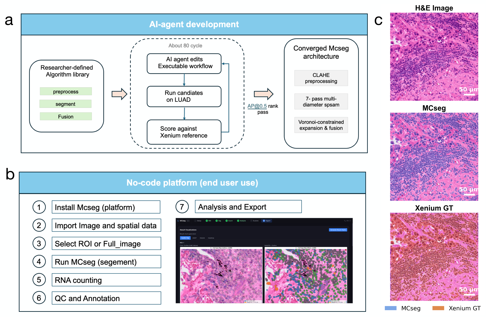

# MCseg

### AI agent-guided workflow search for no-code cell segmentation and transcript attribution in spatial transcriptomics

[](LICENSE)
[](pyproject.toml)

**MCseg (Multiple Cellpose Segmentation)** is a local, no-code platform for turning **Visium HD H&E images and 2-µm expression bins into cell-level spatial transcriptomic data**. It connects ROI selection, cell segmentation, transcript attribution, quality control, clustering, cell-type annotation, spatial visualization, and export in one web interface. A CLI supports scripted whole-slide processing.

An AI agent helped search candidate workflows during method development. **Routine analysis runs the retained workflow locally: no AI-agent search, external language-model API, or Xenium reference data is required.** Initial installation and model downloads require internet access.

[Desktop installation](#desktop-installation-windows-and-macos) · [Quick start](#quick-start) · [中文](README_zh.md) · [Workflow](#workflow) · [Research results](#research-results) · [CLI](#command-line-use) · [User guide](docs/usage.md) · [Reproducibility](#reproducibility) · [Citation](#citation)

## Workflow

<p align="center">
  
</p>

**Development and deployment are separate.** (a) Researchers define the operation library, reference data, objective, and execution constraints; an agent proposes and evaluates candidates, and researchers review the retained workflow. (b) Users run the local platform on their own images and spatial expression data. (c) Representative H&E, MCseg masks, and Xenium reference boundaries. Xenium boundaries are computational references, not manually drawn whole-cell ground truth.

<details>
<summary>Figure source and model terminology</summary>

This figure is cropped from the supplied manuscript artwork without resampling or changing panel content. The original artwork contains the typographical label “spsam”, which refers to `cpsam`; see the [model implementation](#model-implementation). Crop provenance is recorded in [figure-source.md](docs/figure-source.md).

</details>

| Step | What you do | Main result |
| --- | --- | --- |
| Set up data | Select H&E and matching Space Ranger outputs | Validated input paths |
| Select regions | Draw ROIs, or use the whole-slide CLI | Image crops and spatial coordinates |
| Segment cells | Run the multi-pass ensemble and constrained expansion | Cell masks |
| Attribute expression | Assign spatial bins to masks and aggregate counts | Cell × gene AnnData matrix |
| Analyze | Filter cells, compute PCA/UMAP/Leiden, and annotate with CellTypist | Cell profiles and labels |
| Explore and export | Inspect spatial expression and export results | AnnData, Xenium Explorer, or Loupe Browser outputs |

See the [interface tour](docs/usage.md#interface-tour), [step-by-step guide](docs/usage.md#usage-guide), and [output structure](docs/usage.md#output-structure).

## Research results

The following results are reported in the September 18 manuscript. They describe different evaluation settings and should not be interpreted as a single overall performance ranking.

| Evaluation | Reported result | Interpretation |
| --- | --- | --- |
| **LUAD: fixed parameters, 6 development ROIs** | PQ **0.472 ± 0.072**, versus **0.432 ± 0.037** for Optuna-tuned 2Cseg | +0.040 absolute PQ (about 9% relative); these ROIs contributed to development |
| **LUAD: reference-guided calibration** | PQ **0.554 ± 0.063** | Upper-bound analysis: expansion strategy and distance selected per ROI using Xenium masks; not routine deployment performance |
| **CRC: expert-reviewed ENACT reference** | Micro-F1 **0.805 vs 0.723** for MCseg vs ENACT | Comparison restricted to **10,275 jointly covered reference cells**; MCseg covered 65.1% of all 20,991 reference centroids |
| **CRC: transcript-derived quality, 15 ROIs** | NED **0.727 vs 0.712**; lineage-exclusive co-expression **0.49% vs 0.67%**, MCseg vs Space Ranger | Sign-flip p = 0.008 and 0.010, respectively; similar UMI density (**11.6 vs 11.7 UMIs/µm²**), but lower transcript capture (**0.737 vs 0.934**) |
| **Fresh-frozen breast cancer: fixed workflow** | **96,876 cells**, FTC **0.514**, median **1,502 UMIs/cell**, NED **0.519** | Transfer without a new architecture search; not evidence of superiority in breast cancer |

**How to read these metrics.** PQ combines boundary agreement and detection completeness. FTC measures the fraction of tissue UMIs assigned to masks. NED measures expression separation between neighboring masks; it is not an absolute measure of geometric accuracy. Higher NED or lower lineage mixing alone does not establish a better segmentation, and similar UMI density does not imply equal transcript capture.

**Scope of validation.** LUAD geometric results are development-set estimates. The expert-reviewed CRC region is non-overlapping with the 15 CRC ROIs but comes from the same tissue section; its reference centroids originated from StarDist before manual review. Cross-tissue testing is limited, and expansion settings remain sensitive to tissue morphology and image scale. See [example results](docs/usage.md#example-results) and the [analysis directory](analysis/) for supporting material.

## Quick start

### Inputs and requirements

Prepare an H&E image and its **matching** Space Ranger Visium HD outputs:

- H&E image, typically a tiled BigTIFF (`.btf`, `.tif`, or `.tiff`).
- `tissue_positions.parquet` and `filtered_feature_bc_matrix.h5` for the **2-µm bins**.
- The associated spatial metadata needed by the selected workflow. Separately scanned images require registration before transcript attribution; see [image formats and alignment](docs/usage.md#supported-image-formats).

Source installation uses **Python ≥3.10**, **uv**, and **Node.js/npm** for the web UI. CLI-only use does not require Node.js. Plan for at least 16 GB RAM and additional memory for large images; actual memory and disk needs depend on the data and installed dependencies. The manuscript analyses used Apple Silicon with MPS. CPU execution is supported, but CPU runtime was not systematically benchmarked; the reported geometric runs took approximately 20–40 min per ROI with MPS.

### Desktop installation (Windows and macOS)

Desktop packages include the MCseg interface, backend application files, and the `uv` environment manager. **You do not need to install Python, Node.js, Rust, or uv manually.** On first launch, the app downloads and prepares its Python/PyTorch/Cellpose dependencies. It is not an offline installer: keep the computer online and allow at least 15 GB of free disk space for setup, plus space for your datasets and results.

| Platform | Desktop package | Architecture |
| --- | --- | --- |
| Windows 10/11 | [0.2.0 legacy installer](https://github.com/ddmanyes/MCseg/releases/download/v0.8.0/mcseg_0.2.0_x64-setup.exe); clean 0.2.1 build pending | Intel/AMD x64 |
| macOS 12+ | [mcseg_0.2.1_aarch64.dmg (pre-release)](https://github.com/ddmanyes/MCseg/releases/download/desktop-v0.2.1/mcseg_0.2.1_aarch64.dmg) | Apple Silicon (M-series) |

**Release status:** [Desktop 0.2.1](https://github.com/ddmanyes/MCseg/releases/tag/desktop-v0.2.1) provides the cleaned macOS package with [SHA-256](https://github.com/ddmanyes/MCseg/releases/download/desktop-v0.2.1/mcseg_0.2.1_aarch64.dmg.sha256) and [build provenance](https://github.com/ddmanyes/MCseg/releases/download/desktop-v0.2.1/mcseg_0.2.1_aarch64.dmg.build.json). It passed build, payload, ad-hoc signature, and static credential checks; fresh-machine installation and full analysis remain unverified. Windows 0.2.1 has not yet been built. The historical Windows 0.2.0 package still contains developer input-path defaults; select your own paths before use. The older macOS 0.2.0 package bundled developer analysis state and is superseded by this candidate.

Desktop versioning is separate from the source/Python package version (`0.8.0`). GitHub's “Source code” archives are not desktop installers. The listed macOS package is for Apple Silicon; an Intel Mac installer is not listed here.

#### Windows

1. Double-click **`mcseg_0.2.0_x64-setup.exe`** and follow the installation wizard.
2. If Microsoft Defender SmartScreen reports an unrecognized app, verify that the installer came from the MCseg maintainer before selecting **More info → Run anyway**, when available under your system policy.
3. Launch **MCseg** from the Start menu. Leave the setup window open while it prepares the environment and starts the analysis engine.
4. When initialization completes, the main interface opens. Select your data and follow the [usage guide](docs/usage.md#usage-guide).

#### macOS (Apple Silicon)

1. Open **`mcseg_0.2.1_aarch64.dmg`**, then drag **MCseg** into **Applications**.
2. Launch the app from Applications. If macOS blocks an unnotarized build, first verify its source, then use **System Settings → Privacy & Security → Open Anyway**, if offered, and confirm the prompt.
3. Keep the Mac online and the setup window open while the Python environment and dependencies are prepared.
4. The main interface opens when initialization finishes. Subsequent launches reuse the prepared environment.

#### First-launch troubleshooting

| Symptom | What to check |
| --- | --- |
| Setup appears stalled | Expand the setup log; check connectivity, free disk space, and whether packages are still downloading. Resolve the reported error before choosing **Retry**. |
| Port 8001 is already occupied | Stop your other MCseg/backend session, or identify the unrelated application using the port before proceeding. |
| Installer does not match the computer | Check x64 Windows versus Apple Silicon macOS; use source installation for other environments. |

### Install from source

For developers, CLI users, or systems without a matching desktop package:

Install [uv](https://docs.astral.sh/uv/getting-started/installation/) and [Node.js](https://nodejs.org/), then clone onto a local native filesystem (APFS on macOS, NTFS on Windows, or a native Linux filesystem):

```bash
git clone https://github.com/ddmanyes/MCseg.git
cd MCseg
uv sync
npm --prefix frontend install
```

Start the backend from the repository root:

```bash
uv run uvicorn backend.main:app --host 127.0.0.1 --port 8001
```

In a second terminal, from the same repository root:

```bash
npm --prefix frontend run dev
```

Open **[http://localhost:3000](http://localhost:3000)**, select your data, and follow the [usage guide](docs/usage.md#usage-guide). The same commands work in PowerShell. Initial dependency and model downloads can take time.

<details>
<summary>Launcher scripts and external drives</summary>

The repository also provides `start.sh` and `start.ps1`. Inspect them before use: the current macOS shell launcher recreates the repository environment as a symlink to `~/.venvs/msseg` and terminates processes listening on ports 8001/3000. The two-terminal commands above make those steps unnecessary on a native filesystem.

For ExFAT external drives, prefer keeping the checkout and Python environment on the system disk while reading data from the external drive. Windows ExFAT installations may require `UV_LINK_MODE=copy`; see [troubleshooting](docs/usage.md#troubleshooting).

</details>

## Command-line use

The executable retains its existing name, **`msseg-segment`**.

```bash
uv run msseg-segment \
  --btf /path/to/image.btf \
  --tp /path/to/tissue_positions.parquet \
  --h5 /path/to/filtered_feature_bc_matrix.h5 \
  --out /path/to/output \
  --tissue crc \
  --cpsam
```

This runs segmentation, bin attribution, cell-matrix aggregation, and CellTypist annotation. Add `--export-xenium` for an Explorer bundle, `--skip-celltypist` to omit annotation, or `--no-gpu` for CPU execution. Supplying only `--btf` and `--out` runs segmentation alone. `--cpsam` enables three additional passes for the seven-pass configuration. Both the primary and additional passes use `cpsam`.

```bash
uv run msseg-segment --help
```

See [all options and PowerShell examples](docs/usage.md#cli-no-ui-whole-slide-pipeline).

## Method and configuration

The retained workflow combines CLAHE preprocessing, multiple Cellpose `cpsam` passes across image representations and diameter settings, priority-based mask integration, optional transcript-density rescue, and Voronoi-constrained boundary expansion. The application exposes a shorter configuration and optional passes for the seven-pass workflow.

Transcript attribution maps bin centroids into image/mask coordinates and sums their counts into a sparse cell × gene matrix. Correct registration, pixel scale, and ROI offsets are essential. The application's RNA-counting stage can additionally expand masks through `rna_counting.dilation_px`; this changes the attribution geometry and must be recorded when comparing results or reproducing a benchmark.

Configuration lives in [`config/pipeline.yaml`](config/pipeline.yaml) and [`config/profiles/`](config/profiles/). Tissue profiles provide starting values; pipeline and runtime settings can override them. Review the final masks and effective parameters for each dataset.

### Model implementation

MCseg uses Cellpose **`cpsam`** for its multi-pass ensemble. The passes vary image representation, diameter, and cell-probability threshold rather than combining different model families. The seven-pass configuration consists of three diameter-based passes, one hematoxylin pass, and three additional `cpsam` passes. The [`_load_primary_model`](backend/src/segmentation/cellpose_runner.py) loader records the resolved model-weight path in the run log.

For reproducibility, retain the analysis revision, environment, actual model weights, and effective run configuration. The scientific results above are manuscript-reported values, not results rerun for this README.

## Reproducibility

| Resource | Contents |
| --- | --- |
| [`analysis/scripts/`](analysis/scripts/) | Benchmark analyses and figure scripts |
| [`analysis/data/`](analysis/data/) | Committed metrics and summary tables |
| [`analysis/supplementary/`](analysis/supplementary/) | Supplementary notes and tables; check their revision against the manuscript |
| [`docs/autoResearch/`](docs/autoResearch/) | Development prompt, runner, and starter templates |
| [`backend/src/`](backend/src/) | Deployed analysis implementation |

The agent-guided development loop adapted the AutoResearch approach: researchers chose candidate operations, reference data, scoring, prompts, and execution limits; the agent proposed and evaluated executable workflows, and researchers reviewed the retained configuration. The development templates are separate from routine analysis and require their own API setup. Their presence alone does not establish a complete archive of every historical search run.

For a reproducible run, retain the Git revision, resolved dependencies, model-weight identity, input dataset and coordinates, effective segmentation/counting settings, and logs. The repository package retains the historical name `msseg`.

### Data availability

- **LUAD:** paired Visium HD and Xenium Prime data from the 10x Genomics dataset portal; six development ROIs.
- **CRC:** [GEO GSE280318](https://www.ncbi.nlm.nih.gov/geo/query/acc.cgi?acc=GSE280318); 15 transcript-benchmark ROIs and a separate expert-reviewed ENACT region from the same section.
- **Breast cancer:** public fresh-frozen Visium HD data from the 10x Genomics dataset portal, used for fixed-workflow transfer.

The manuscript states that processed AnnData objects and segmentation masks will be deposited in Zenodo. A public deposit identifier and manuscript DOI are not yet provided here.

## Citation

If you use MCseg, please cite the manuscript:

> Chan, C.-R., Chang, N.-W., Wang, C.-Y., Tan, H.-Y., and Lin, S.-J. (2026). **MCseg: AI agent-guided workflow search for no-code cell segmentation and transcript attribution in spatial transcriptomics.** Manuscript.

Chan and Chang contributed equally. A bioRxiv preprint is planned; the citation will be updated after posting and DOI assignment.

## Support and license

For usage details, see the [user guide](docs/usage.md); for problems, [open an issue](https://github.com/ddmanyes/MCseg/issues) with your OS, Git revision, package versions, command/settings, and relevant logs.

MCseg is released under the [MIT License](LICENSE). See [third-party notices](THIRD_PARTY_NOTICES.md) and the [desktop build and verification guide](docs/desktop-build.md).
